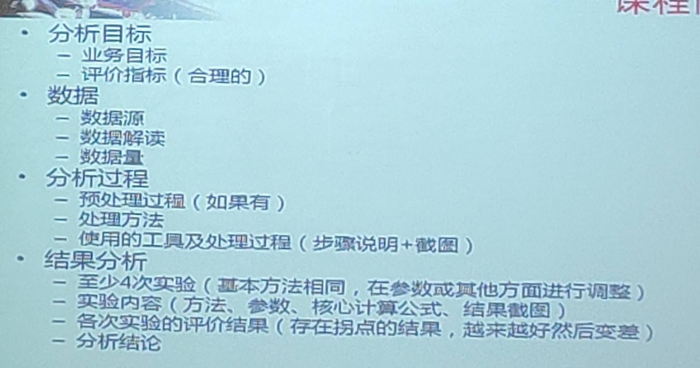

# data-mining
北京大学软件与微电子学院 数据挖掘期末作业

作业提交截止时间 
> 2019-06-20 23:59

##  目录说明     
├── data  //数据文件夹         
├── data_mning //数据挖掘项目目录      
│   └── poetry_mning  //古诗词数据挖掘       
├── docs  //详细说明文档  
│   └── 古诗词数据挖掘调研.md  //古诗词数据挖掘调研          
├── tests  //单元测试  
├── .gitignore  //git忽略文件        
├── manage.py  //入口文件      
├── READEME.md  //说明文档   
└── requirements.txt  //依赖包   
